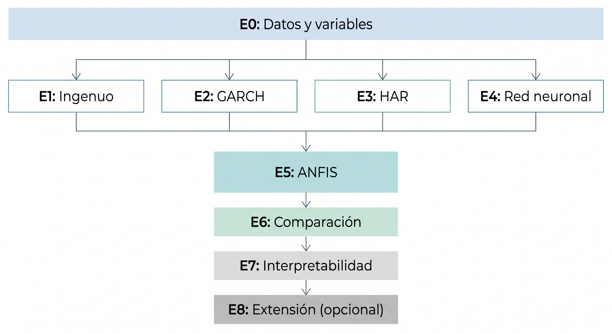

## Planteamiento del TFG

Antes de empezar a definir conceptos, cabe dejar muy clara la pregunta básica que logra responder este tfg: **¿Aporta algo un modelo nuero-difuso, frente a los modelos clásicos, cuando lo que hay que predecir es la volatilidad de un activa financiero? Y en caso que aporte poco en cuanto a precisión, ¿lo compensa en interpretabilidad?**

Fijemonos que la pregunta no sugiere que vayamos a construir el mejor predictor de volatilidad, sino que vamos a evaluar honestamente el caso a traves de un trabajo en investigación en lugar de realizar una demostración técnica, permitiendo que un resultado negativo a la pregunta siga siendo de utilidad.

#### **01. Conceptos mínimos para el entendimiento de la pregunta**

Aún desglosando más ampliamente en las partes teóricas correspondientes, cabe dar una mínima definición de los conceptos básicos para poder entender completamente la pregunta, así como empezar a dar contexto del problema que se quiere resolver.

*Activo financiero*: instrumento que se puede comprar y vender, con un precio que evoluciona a lo largo del tiempo. En nuestro caso utilizaremos el índice bursátil S&P500, el cual agrega mediante una ponderación las 500 empresas con mayor capitalización de Estados Unidos

*Volatilidad*: la desviación típica de los rendimientos, es decir, una medida de cuánto oscilan. Formalmente, se tiene que si $\sigma^2 = E[(r-E[r])^2]$ es la varianza, la volatilidad es $\sigma$. Intuitivamente mide cuán de agitado esta el mercado. Es la magnitud central en la gestión de riesgo y la valoración de opciones.

El problema central es que a diferencia de los precios, la volatilidad no se observa, si no que es un parámetro de la distribución que los genera. Es decir, todo lo que podemos hacer es estimarla, y como estimación que es será imperfecta. Esto genera una consecuencia que hay que tener presente: no estamos comparando predicciones contra la verdad, sino contra un estimador ruidoso de la verdad. Entraremos más en detalle más adelante.

*Predicción de la volatilidad*: dado lo que sabemos hasta hoy, cuánto oscilara el mercado en los próximos días. Es predecible en un grado razonable, a diferencia de la dirección del precio, por un fenómeno llamado agrupamiento de volatilidad que se vera más adelante.

#### **02. El planteamiento formal**

Sea $F_t$ toda la información disponible en el dia $t$ , es decir los precios hasta ese día, entonces buscamos una función:

$$ f : \mathbb{R}^n \rightarrow \mathbb{R} , \ \ \ \ \ \hat{y}_t = f(x_t)$$

en donde, $x_t \in \mathbb{R}^n$ es un vector de variables exclusivamente con información de $F_t$ e $\hat{y}_t$ estima la volatilidad de los días siguientes.

Aquí la idea general del trabajo es que cada modelo es una família de funciones distintas, y el ejercicio consiste en compararlas:

| Modelo | Família de funciones $f$ 
| --- | --- | 
| Ingenuo | La identidad: predice que mañana será como hoy |
| GARCH | Una recursión paramétrica sobre la varianza |
| ARCH | Funciones lineales de $x$ |
| Red Neuronal | Composición de aplicaciones afines y no linealidades |
| ANFIS | **Combinaciones convexas de funciones lineales locales, con pesos dados por reglas difusas** |

#### **03. El mapa de experimentos**

Explicamos brevemente el mapa de la parte práctica del trabajo, desglosandolas en diferentes etapas, las cuales cada una se explicara más detenidamente en su sección correspondiente. Por ahora nos limitamos a realizar una breve introducción de cada una de las etapas.

0. **Datos y variables**  
El objetivo es construir una tabla sobre la cual se trabajara todo lo demás. Una fila por día con las variables de entrada y el objetivo. Deberemos tomar diferentes decisiones como que periodo tomar, como se define exactamente el objetivo, variables de entrada, como partir los datos de entrenamiento y prueba, entre otras.  
El producto final será un objeto dataframe limpio. Es obvio que este debe ser el primer paso, ya que todos los modelos que hagamos a continuación comparten los mismos datos. Aunque suene obvio, cabe destacar que debe ser la parte en donde hemos de ir con más cuidado, ya que si cometemos un error, todos los resultados posteriores estaran mal.
1. **Modelo ingenuo**  
El objetivo es predecir que la volatilidad futura será igual a la reciente, sin ajustar nada. La razón de porque existe, es el hecho de que necesitamos un suelo. Es decir, si un modelo no supera el "mañana será como hoy", entonces ese modelo no sirve para nada. Nos referiremos a él con el termino *baseline*. 
2. **GARCH**  
El objetivo es ajustar el modelo econométrico clásico de volatilidad. GARCH (*Generalized Autoregresive Conditional Heteroskedasticity*, Bollerslev 1986), "Heterocedasticidad" lo cual nos indica que la varianza no es constante en el tiempo y "Condicional" indica que la varianza de mañana depende de lo observado hasta hoy. El modelo postula: $$\sigma^2_t = w + \alpha r^2_{t-1} + \beta \sigma^2_{t-1}$$ Es decir, la varianza de hoy es una mezcla de una constante, el rendimiento de ayer y la varianza de ayer.  
Cabe destacar que es un modelo de tres parámetros el cual captura con una cierta elegancia el agrupamiento de volatilidad, y le valió a Robert Engle el Nobel de Economía en 2003.
3. **HAR**  
El objetivo de este modelo es el de ajustar una regresión lineal sobre la volatilidad pasada a tres escalas temporales. HAR (Heterogeneous AutoRegressive, Corsi 2009) se inspira en la idea de un mercado heterogéneo, en el cual conviven participantes con horizontes de negociación distintos (corto, medio y largo plazo). El modelo aproxima la memoria larga de la volatilidad mediante una cascada aditiva de componentes correspondientes a esos horizontes. En la práctica usaremos retractos diarios, semanales y mensuales con ventanas de 1,5, y 22 días.  
Cabe mencionar que es el modelo más importante de los 3 modelos *baselines* vistos hasta ahora. Esto es así porque dicho modelo comparte las mismas entradas que el modelo final **ANFIS**. Es decir, convierte la comparación en un experimento limpio; mismas variables, misma información siendo la única diferencia la familia de funciones.  
Se tiene que HAR es una regresión lineal, $$\hat{y} = \beta_0 + \beta_1 x_1 + \beta_2 x_2 + \beta_3 x_3$$ con $x_1$, $x_2$ y $x_3$ las volatilidades a 1, 5 y 22 días. 
4. **Red Neuronal**  
El objetivo es crear un modelo de red neuronal, sin nada difuso. Será interesante para poder extraer conclusiones en el caso de que haya mejora. Es decir si ANFIS mejora a HAR, ¿es porque es no lineal, o porque es difuso? Luego comparando ANFIS, con HAR y con una red neuronal (la cuales  no lineal y no difusa), podremos extraer conclusiones certeras del porque de la mejora de ANFIS.
5. **ANFIS**  
Es el modelo central, implementado capa por capa. ANFIS produce una media ponderada de varias fórmulas lineales, donde los pesos dependen del punto en el que estés: $$\hat{y} = \sum_{i=1}^R \hat{w}_i(x) · (p_0^i + p_1^ix_1 + p_2^ix_2 + p_3^ix_3) $$ donde $R$ es el número de reglas y $\hat{w}_i(x)$ es el peso normalizado de la regla $i$, con $\sum_{i=1} \hat{w}_i(x) = 1$. Se observa que si se tiene que $R=1$, entonces $\hat{w}_1(x) = 1$ y por consiguiente se obtiene $$\hat{y}(x) = p_0 + p_1x_1 + p_2x_2 + p_3x_3$$ que es exactamente HAR.  
Por lo tanto la diferencia con $R>1$, es que obtenemos que ANFIS ajusta **una regresión lineal distinta en cada región difusa del espacio de entrada** y las mezclas suavemente. Más adelante profundizaremos más en detalle, por ahora nos limitaremos a nombrar las subetapas del modelo:
    1. **Funciones de pertenencia:** definir y visualizar cómo seconvierte un número en grados de pertenencia a conceptos como "baja", "media", "alta".
    2. **Inferencia hacia adelante**: dado un vector de entrada, calcular la salida del sistema difuso completo
    3. **Inicialización:** colocar las funciones de pertenencia en posiciones razonable antes de entrenar (mal hecho, el modelo no converge)
    4. **Entrenamiento:** ajustar los parámetros minimizando el error
    5. **Ajuste de hiperparámetros**
6. **Evaluación comparativa**
El objetivo es comparar los anteriores modelos a través de una tabla que respondera a la pregunta del trabajo. Dicha tabla contendrá todos los modelos sobre el mismo conjunto de prueba, con las mismas métricas más un desglose por régimen: período tranquilo frente a período de estrés.  
Porque esta última parte es importante: se busca poder evaluar la degradación en escenarios de estrés. Es decir un modelo que gana de media, pero por ejemplo se hunde en Marzo del 2020 (COVID) no es útil para la gestión de riesgo, ya que es precisamente cuando se necesita.
7. **Interpretabilidad**  
El objetivo aquí es poder entender las reglas las cuales ha seguido el modelo y comprobar si tienen sentido económico. 
8. **Extensión** (opcional)  
Poder volcar el modelo como una herramienta invocable por un agente de IA. Solo procederemos si todas las etapas anteriores son completadas correctamente.